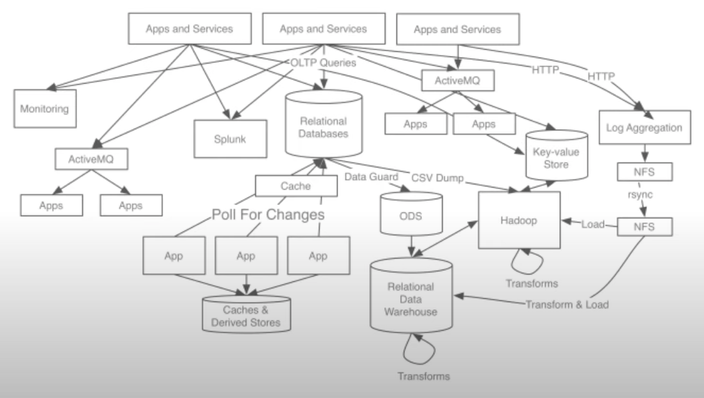
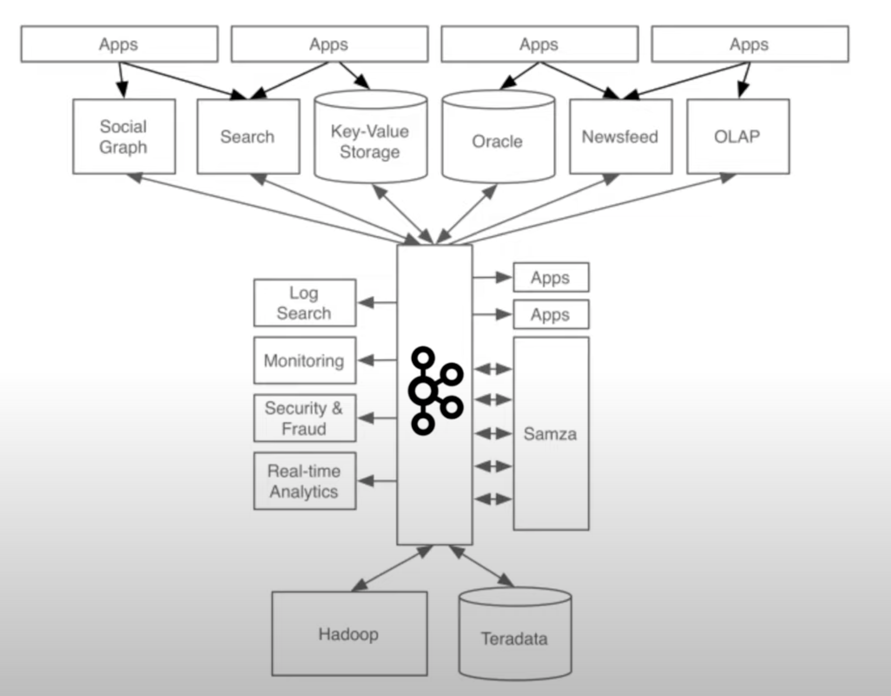
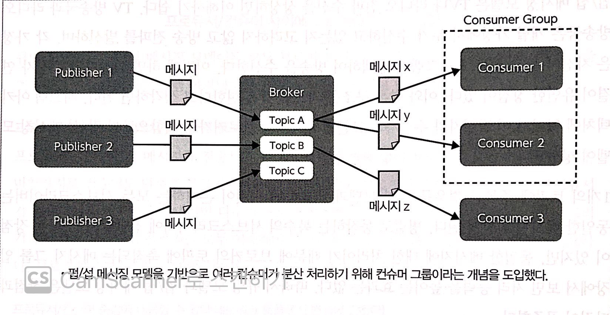

# [94_Kafka](./94_Kafka)

## 기본정보

- 목적 : 스트림의 의미를 이해하자. 카프카의 내부 구조를 알자
- 기간 : 2021/11/05 ~ 2021/11/08
- Ref :
  - 책 <실전 아파치 카프카>
  - 유튜브 [[Kafka의 등장배경\]](https://www.youtube.com/watch?v=waw0XXNX-uQ)

## 스트림의 의미

- 발단은 스프링 코드를 읽어보면서 였다. 
  java collection을 스트림으로 만들면 filter, map 등을 적용하기 좋게 된다. [[참고\]](https://aljjabaegi.tistory.com/397)

```scala
@Override
public Optional<Member> findByName(String name) {
    return store.values().stream()
            .filter(member -> member.getName().equals(name))
            .findAny();
}
```

- 그러면 여기서 stream과 Kafka의 stream은 어떻게 같은가? 
  둘다 공통적으로 어떤 통에 넣고 큐로 처리한다.


## Kafka의 요구사항과 구조

왜 Kafka인가?

- 상품 데이터는 수시로 업데이트된다. 할인 행사가 있다거나, 상품이 품절된다거나.. 과거에 아키텍쳐가 복잡했을 때에는 데이터가 업데이트 되었음을 알려주는 게 복잡했다. 그래서 kafka라는 툴을 사용해서 데이터를 변경 즉시, 일괄적으로 관리하는 것이다. [[영상\]](https://www.youtube.com/watch?v=waw0XXNX-uQ)






Kafka의 구조



- 데이터 처리량이 많아지면서 기존의 동기 / 싱글스레드 방식으로 감당할 수 없었다. 그래서 비동기 / 멀티스레드 방식을 도입해야 했는데, 카프카는 이를 지원한다.

- Kafka의 목표는 다음과 같다. 1️⃣높은 처리량으로 실시간 처리한다, 2️⃣임의의 타이밍에서 데이터를 읽는다, 3️⃣다양한 제품과 시스템에 쉽게 연동한다, 4️⃣메시지를 잃지 않는다.
- Kafka는 데이터를 실시간으로 처리하는 게 핵심이다. 이를 구현하기 위해 Kafka는 큐잉 메시징 모델, 펍섭 메시징 모델을 응용했다. 먼저 `펍 ↔ 브로커 ↔ 섭`로 구조를 분해했다. 펍은 메시지가 어느 섭에 전달되는지 모르고, 섭도 메시지가 어느 펍에서 오는지 모른다. 다만 각자의 할 일을 할 뿐. 이런 역할 분리로 각자의 부담을 줄이고, 처리량을 늘렸다.
- 또한 메시지를 잃지 않아야 했기에 At least once 전달 보증 기능을 제공한다. 최근에는 Exactly once 수준도 제공한다.
- DB, hadoop, spark와는 어떻게 다를까? DB는 Exactly once `전달 보증 수준`을 중시하는데, 이걸 구현하려면 펍,브로커,섭 간의 통신이 추가된다. Kafka는 전달 보증 수준을 낮추는 대신, 처리량을 높이는 선택지를 택했다. 하둡과 스파크는 데이터를 축적해 `일괄` 처리하는 데 초점이 맞춰져 있었기 때문에, 실시간으로 처리하는 데에 적합하지 않았다.


## 카프카 설치하기

```bash
# 카프카 클러스터 실행
sudo systemctl start confluent-zookeeper
sudo systemctl start confluent-kafka

# 토픽 작성
kafka-topics --zookeeper kafka-broker01:2181, kafka-broker02:2181 
--create --topic first-test --partitions 3 --replication-factor 2
# 토픽 확인
kafka-tppics --zookeeper kafka-broker01:2181, kafka-broker02:2181
--describe --topic first-test
> topic, partition count, replication factor

# 프로듀서 실행 및 토픽 지정
kafka-console-producer --broker-list kafka-broker01:9092, kafka-broker02:9092
--topic first-test

# 컨슈머 실행 및 토픽 지정
kafka-console-consumer --bootstrap-server kafka-broker01:9092, kafka-broker02:9092
--topic first-test

# 프로듀서에 발신할 메시지 입력
kafka-console-producer --broker-list
> Hello Kafka!

# 컨슈머가 수신한 메시지 출력
kafka0console-consumer --bootstrap-server
> Hello Kafka!
```

- 2181 : 주키퍼에 접속할 때의 포트 번호
- 9092 : 카프카가 통신에 사용하는 포트 번호의 기본값


## 카프카 애플리케이션

```java
// producer
// maven에 dependency 추가
package com.example.chapter4;

import org.apache.kafka.clients.producer.*;
import java.util.Properties;

public class FirstAppProducer {
    private static String topicName = "first-app";

    public static void main(String[] args) {

        // producer 설정
        Properties conf = new Properties();
        conf.setProperty("bootstrap.servers", "kafka-broker01:9092, kafka-broker02:9092");
        conf.setProperty("key.serializer", "org.apache.kafka.common.serialization.IntegerSerializer");
        conf.setProperty("value.serializer", "org.apache.kafka.common.serialization.StringSerializer");
        
        // producer 생성
        Producer<Interger, String> producer = new KafkaProducer<>(conf);

        int key;
        String value;
            for(int i = 1; i <=100;i++) {
                key = i;
                value = String.valueOf(i);

                // 발신할 메시지
                ProducerRecord<Integer, String> record = new ProducerRecord<>(topicName, key, value);
                
                // ack를 받았을 때 실행할 작업 등록
                producer.send(record, new Callback() {
                    @Override
                    public void onCompletion(RecordMetadata metadata, Exception e) {
                        if (metadata != null) {
                            String infoString = String.format("Success partition:%d, offset:%d", metadata.partition(), metadata.offset());
                            System.out.println(infoString);
                        } else {
                            String infoString = String.format("Failed:%s", e.getMessage());
                            System.out.println(infoString);
                        }
                    }
                });
            }
        // producer 닫기
	    producer.close();
    }
}
// consumer
package com.example.chapter4;

import org.apache.kafka.clients.consumer.*;
import org.apache.kafka.common.TopicPartition;

import java.io.InterruptedIOException;
import java.util.*;

public class FirstAppConsumer {
    private static String topicName = "first-app";
    public static void main(String[] args) {

				// consumer 설정
        Properties conf = new Properties();
        conf.setProperty("bootstrap.servers", "kafka-broker01:9092, kafka-broker02:9092");
        conf.setProperty("group.id", "FirstAppConsumerGroup");
        conf.setProperty("enable.auto.commit", "false");
        conf.setProperty("key.deserializer", "org.apache.kafka.common.serialization.IntegerDeserializer");
        conf.setProperty("value.deserializer", "org.apache.kafka.common.serialization.StringDeserializer");
	
				// consumer 생성
        Consumer<Integer, String> consumer = new KafkaConsumer<>(conf);
        // 구독할 topic
        consumer.subscribe(Collections.singleTonList(topicName));
        
        for (int count=0; count<300; count++) {
            // 수신한 메시지를 콘솔에 표시
						ConsumerRecords<Integer, String> records = consumer.poll(1);
            for (ConsumerRecord<Integer, String> record: records) {
                String msgString = String.format("key:%d, value:%s", record.key(), record.value());
                System.out.println(msgString);
                
								// 오프셋을 커밋
                TopicPartition tp = new TopicPartition(record.topic(), record.partition());
                OffsetAndMetadata oam = new OffsetAndMetadata(record.offset() + 1);
                Map<TopicPartition, OffsetAndMetadata> commitInfo = Collections.singletonMap(tp, oam);
                consumer.commitSync(commitInfo);
            }
            try {
                Thread.sleep(1000);
            } catch (InterruptedException ex) {
                ex.printStackTrace();
            }
        }
				consumer.close();
    }
}
```