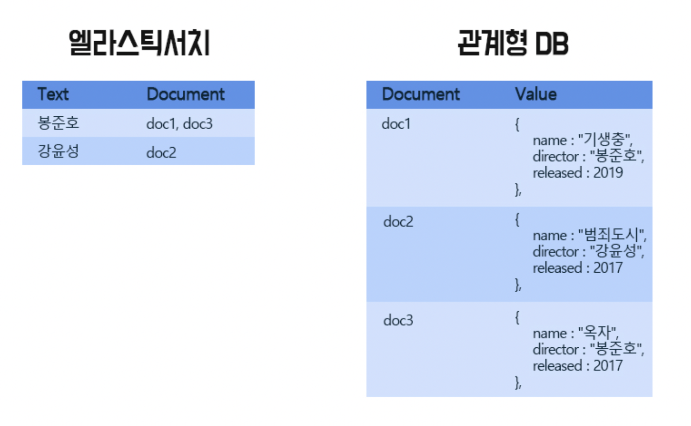
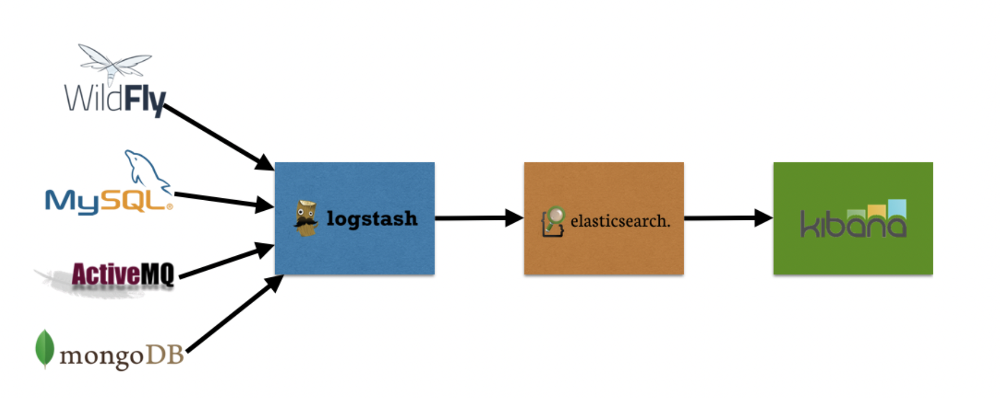

# 97_Elastic Search

## 기본정보

- 목적 : Kafka로 처리한 데이터를 저장할 때에, HDFS나 ES에 저장한다
- 기간 : 2021/10/26 ~ 2021/10/27
- Ref : 

  - [기술 블로그](https://sudarlife.tistory.com/entry/Elasticsearch-간단-개념-장단?category=1114901)

## 구조

엘라스틱 서치는 검색이 빠른 DB다. 다음과 같은 구조로 저장을 하기 때문에 검색이 빠르다. 

하지만 조인하기 어렵고, 트랜잭션을 지원하지 않는 단점이 있다.

## 패키지

ES는 ELK라는 세트로 활용된다. Elastic Search + Logstash + Kibana이다. 상술한 것처럼 저장 구조가 독특하기 때문에 일반적인 관계형 DB를 Logstash로 변환해서, ES에 저장한다. 그리고 해당 데이터를 시각화할 때에는 Kibana를 활용한다.