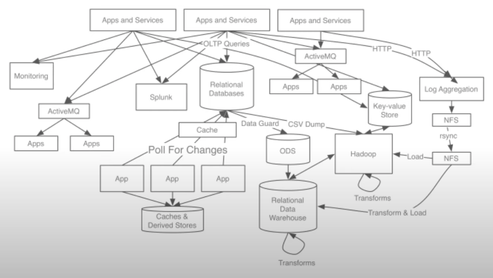
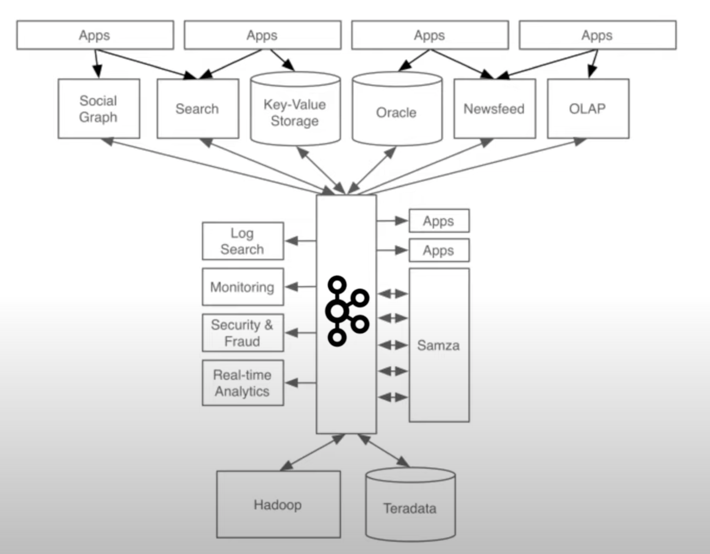
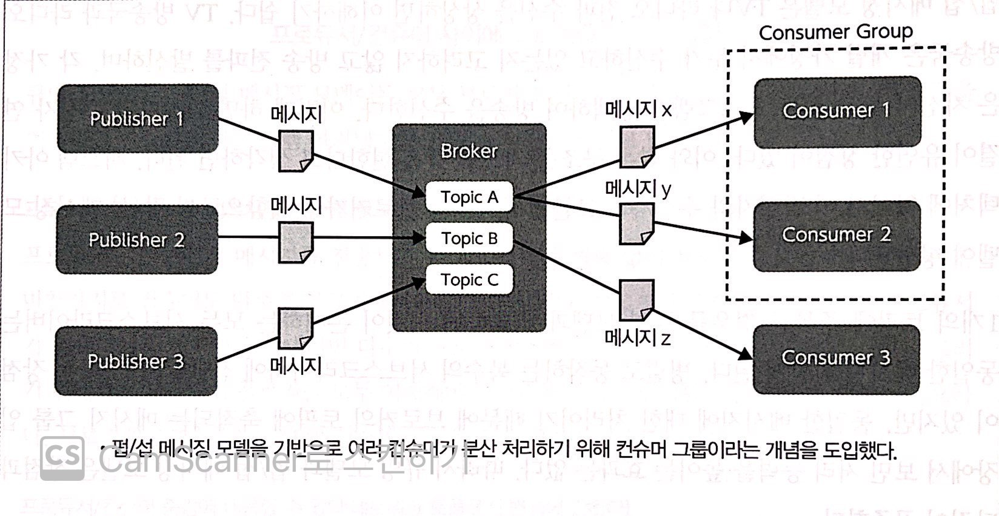

# 98_Kafka

## 기본정보

- 목적 : 스트림 처리를 위해 활용한다. Kafka의 구조, 운영에 대해 알자

  consumer group / broker / topic / partition / kafka는 왜 빠른가 / produce, consume 속도에 따른 구성

- 기간 : 2021/11/05 ~ 2021/11/08

- Ref :
  - 책 <실전 아파치 카프카>
  - 유튜브 [[Kafka의 등장배경](https://www.youtube.com/watch?v=waw0XXNX-uQ)]

### 등장배경

- 상품 데이터는 수시로 업데이트된다. 할인 행사가 있다거나, 상품이 품절된다거나.. 과거에 아키텍쳐가 복잡했을 때에는 데이터가 업데이트 되었음을 알려주는 게 복잡했다. 그래서 kafka라는 툴을 사용해서 데이터를 변경 즉시, 일괄적으로 관리하는 것이다. [[영상\]](https://www.youtube.com/watch?v=waw0XXNX-uQ)
- DB, hadoop, spark 같은 툴로는 스트림 데이터를 처리할 수 없을까? DB는 Exactly once `전달 보증 수준`을 중시하는데, 이걸 구현하려면 여러 통신이 추가된다. Kafka는 전달 보증 수준을 낮추는 대신, 처리량을 높이는 선택지를 택했다. 하둡과 스파크는 데이터를 축적해 `일괄` 처리하는 데 초점이 맞춰져 있었기 때문에, 실시간으로 처리하는 데에 적합하지 않았다.

## Kafka의 구조

- Kafka의 목표는 다음과 같다. 1️⃣높은 처리량으로 실시간 처리한다, 2️⃣임의의 타이밍에서 데이터를 읽는다, 3️⃣다양한 제품과 시스템에 쉽게 연동한다, 4️⃣메시지를 잃지 않는다.
- Kafka는 데이터를 실시간으로 처리하는 게 핵심이다. 이를 구현하기 위해 Kafka는 큐잉 모델, 펍섭 메시징 모델을 응용했다. 
  - 펍섭 모델은 `펍 ↔ 브로커 ↔ 섭`로 구조를 뜻한다. 펍은 메시지가 어느 섭에 전달되는지 모르고, 섭도 메시지가 어느 펍에서 오는지 모른다. 다만 각자의 할 일을 할 뿐. 이런 구조의 장점은 펍 섭의 수가 증감해도 구조가 안정적이고, 각자의 역할에 충실하면서 부담이 줄어든다.
  - 하나의 큐에 여러 섭이 달려있다면, 그 큐는 빠르게 소진될 것이다. 이를 구현한 것이 컨슈머 그룹이다.
- 또한 메시지를 잃지 않아야 했다. 
  - 먼저 브로커에서 메시지를 소실하는 경우에 대비해서, 메시지를 복제해둔다.
  - 펍섭에서 메시지를 소실하는 경우에 대비해서, 메시지가 잘 전송되었는지 확인하는 통신을 추가한다. 초기엔 중복도 허용하는 At least once 전달 보증 기능을 제공했지만 최근에는 Exactly once 수준도 제공한다.

## 분산 처리

- Kafka는 왜 빠른가? 그 이유는 확장성이 용이하고 + 분산 처리가 가능하다는 점에 있다.
- Kafka는 분산 처리를 위해 Consumer Group, Offset, Partition 장치를 두었다.
- Consumer Group 이란, 하나의 큐에 여러 섭이 달려있어서 그 큐를 빠르게 소진하는 것이다.
- 컨슈머 그룹은 Offset 을 활용해 어디까지 메시지를 읽었는지, 어디까지 처리가 완료되었는지 관리한다. 이를 통해 중복 처리를 줄이고, 메시지 소실도 방지할 수 있다.
- Offset 은 메시지 하나하나 혹은 묶음으로 관리할 수 있다. 묶음으로 관리할 경우 + 하나의 큐에 여러 섭이 달려있다면, 비효율이 예상된다.
- 그래서 하나의 큐 내부에는 여러 Partition 이 존재한다. 여러 펍, 여러 섭도 각자의 파티션에서 일하면 된다. 파티션을 구분하는 방법도 생각해야 한다. 메시지의 key 에 따라 다른 파티션에 넣을 수도 있고 무작위로 넣을 수도 있다.
- 파티션의 장점은 분산 처리와 확장성이지만, 단점은 순서를 보증하지 않는다.

- produce, consume 속도에 따른 구성