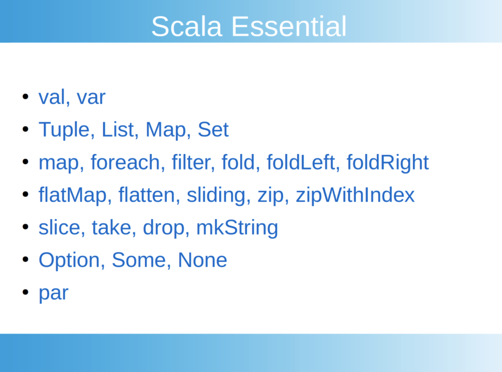

# 99_Scala

## 기본정보

- 목적 : spark의 주요 언어인 scala를 이해한다
- 기간 : 2021/10/11 ~ 2021/10/14
- Ref : 

  - 책 <누구나 쉽게 스칼라 + 플레이>


# Spark

- spark란

  빅데이터를 저장하고 관리하는 기술 하둡은 디스크에 저장하는 반면 spark는 메모리에 저장한다. 그래서 속도가 더 빠르다. java 기반의 scala 언어를 주로 사용하며, python도 지원한다

- 시간복잡도

  알고리즘 문제를 풀 때에는 효율성을 고려해야 한다. 예를 들어 리스트에서 pop(0)은 시간복잡도가 n이다. 0번째 요소를 비워주고, 1번째 요소를 땡겨주고, 2번째 요소를 땡겨주고, 세번째 요소를 땡겨주기 때문이다. 그래서 deque를 써서 시간복잡도를 c로 줄인다.

  이처럼 같은 작업을 하더라도 더 효율적으로 해결하는 방법이 있다. 대용량 데이터를 다루는 spark는 어떻게 구현했느냐에 따라 비용이 널뛰기 때문에, 이것을 고려해서 코드를 작성하는 것이 중요하다.

- 동시성

  빅데이터는 '병렬'로 처리하는 것이 중요하다. 이를 위해서는 변수가 중간에 변경되어선 안 되고, 함수 외부의 변수를 함수 내에서 활용하는 것을 자제해야 한다. 더하여 코드를 간략하게 작성하기 위해, 콤비네이터를 활용한다.

- robust

  에러를 예방하도록 프로그램을 구현해야 한다. 파이썬에서 딕셔너리를 조회할 때에 두 가지 방법이 있다. dct[k]는 k가 없을 때 에러를 반환하지만, dct.get(k)는 에러가 아닌 None을 반환한다. 프로그램을 구현할 때는 이러한 특성을 고려해야 한다.

## Scala



- scala의 collection에는 tuple, list, map, set이 있다.

  - tuple은 1번부터 시작한다
  - list는 0번부터 시작한다
  - map은 key를 가진 딕셔너리로, join이나 reduceByKey 를 하는 데에 유용하다

- 콤비네이터에는 map, foreach, filter, fold 등이 있다.

  - map과 foreach는 컬렉션을 순회하면서 조작한다. 이때에 map은 새로운 것을 만들어내고, foreach는 전체를 돌면서 조작만 한다.
  - fold는 컬렉션을 순회하면서 하나의 값을 만들어나간다.

  ```scala
  val a = Array((1,2), (2,3), (4,5))
  a.map(x => (x._1 + x._2)
  >> res6: Array[Int] = Array(3, 5, 9)
  
  a.foreach( x=> {
  	val k = x._1 + x._2
  	system.out.println(s”${k}”)
  })
  >> 3; 5; 9
  ```

- 시간복잡도를 고려한 함수 구현

  - 이전 합보다 높은 outlier는 합을 계산하는 데에 포함하지 않는다고 하자.
  - filter map을 쓸 수도 있겠으나, 그러면 컬렉션을 두번 순회해야 한다. 반면에 fold를 쓰면, 한번만 순회하고도 같은 결과를 낼 수 있다.

  ```scala
  val a = Array(1,2,6,5,10)
  a.foldLeft(0)( (j,k) => if (j<k) j+k else j )
  ```

- robust

  option은 value에 some, none을 덧씌운 것이다. 값이 없더라도 null 이 아니라 none을 반환한다. 덧씌운 것을 벗기기 위해서는 option.get을 쓴다. 하지만 option이 none일 경우 none.get은 에러를 반환한다. 그러므로 option.getOrElse(k, 0) 이렇게 쓴다.

- 병렬 처리

  par을 했을 때와 아닐 때의 소요 시간을 비교해보자.

  ```scala
  def time[R](block: => R): R = {
      val t0 = System.nanoTime()
      val result = block    // call-by-name
      val t1 = System.nanoTime()
      println("Elapsed time: " + (t1 - t0) + "ns")
      result
  }
  
  val a = (0 to 1000000000).toArray
  
  time{a.foreach( x=> x+1 )}
  >> Elapsed time: 4074254ns
  
  def f = a.par.foreach( x=> x+1)
  time{f}
  >> Elapsed time: 25856239ns
  ```